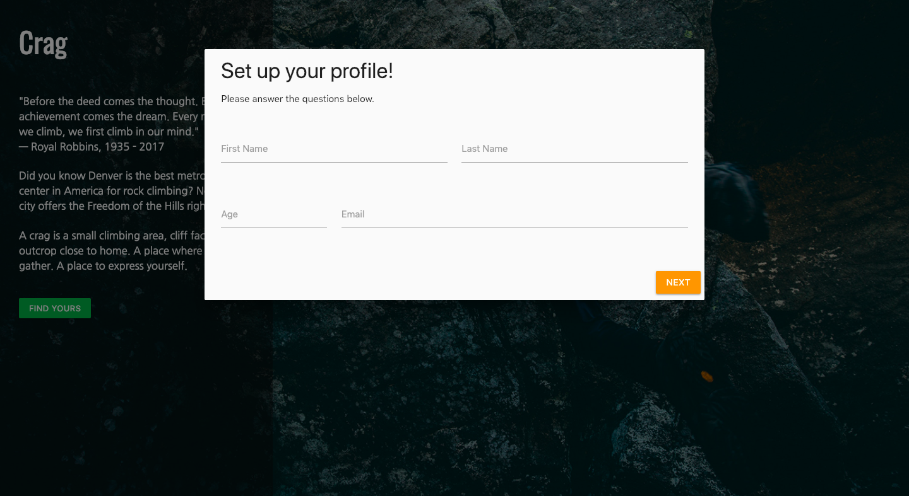
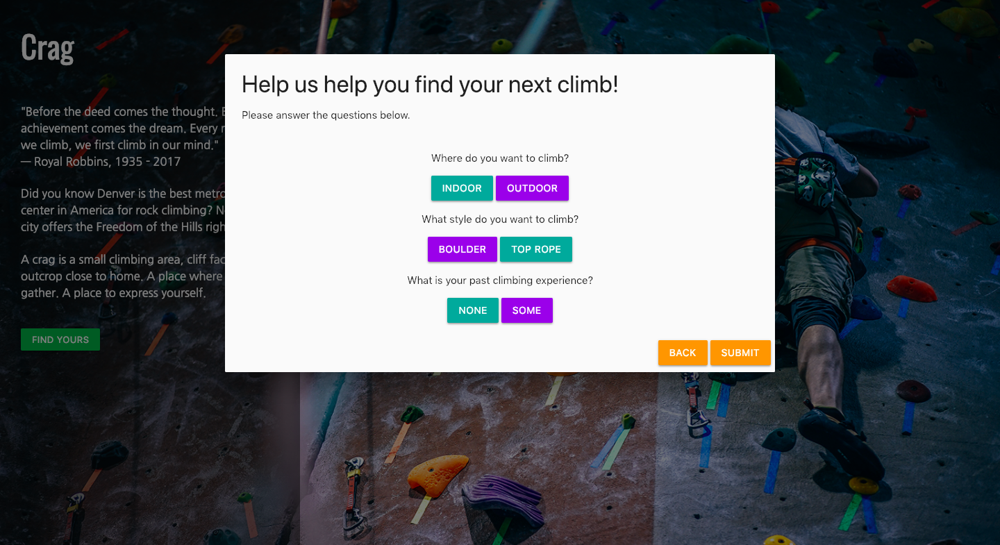
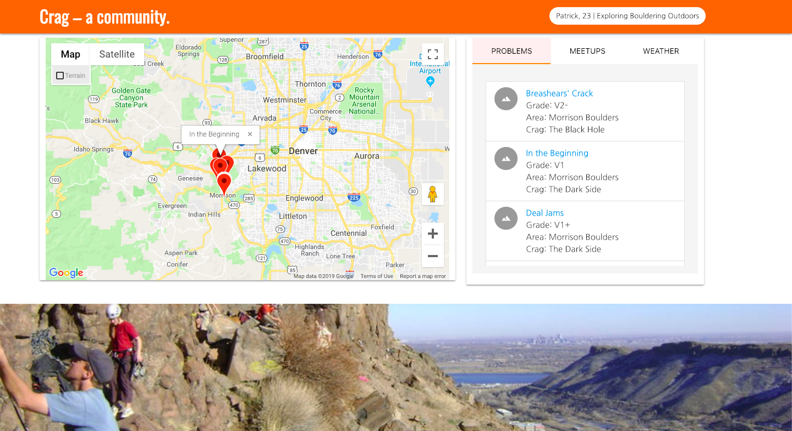
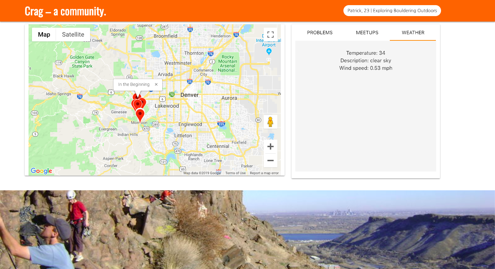
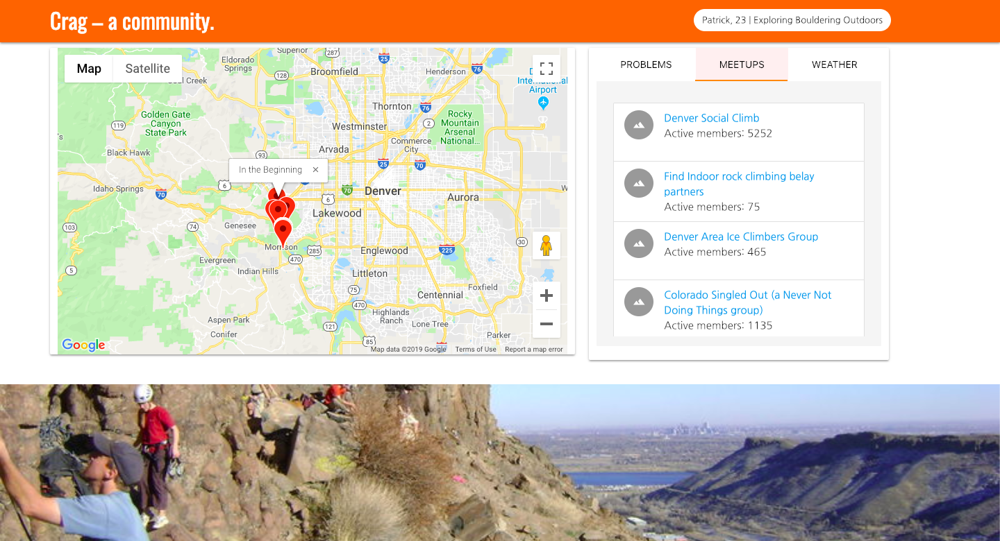

# Crag

#### Web application meant to lower the barrier of entry to those new to rock climbing in the Denver metro. The user first signs up to use the application. 

#### The user then answers a few questions to determine the best climbing locations. 

#### The user is then directed to a map with the chosen locations and is given various information about those locations. 

# Built with:
* HTML - Front End design
* Materalize CSS - Styling
* FireBase - Data Persistance
* Google Map API - Display climbing locations
* OpenWeatherMap API - Display weather information
* Mountainproject API - Find climbing locations
* Meetup API - Display local meetup info

# Contributing
Contact one of the authors directly

# Authors:
* Robert Smithson
* Jacob Yelton
* Mark Ishaug
* Patrick Neff
